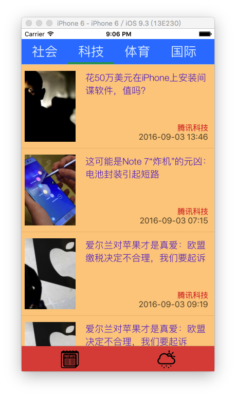
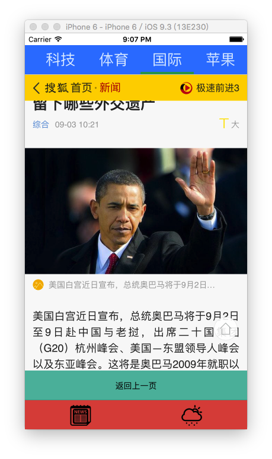
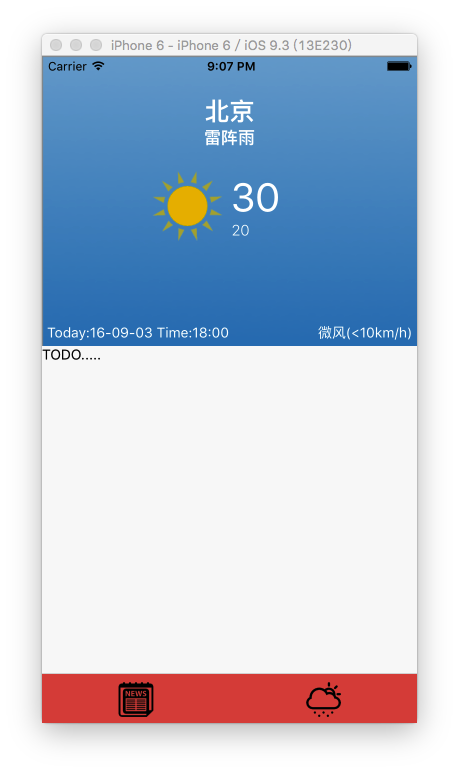

# NewsRn
An example based on React Native

## Set up
1. **Clone the repo:**
		$ git clone https://github.com/Shangyunliang/NewsRN.git  
		$ cd NewsRN
	
1. **Install dependencies:**

		$ npm install

1. **Install react-native-cli:**

		$ npm install -g react-native-cli

1. **Running on iOS:**

		$ react-native run-ios

## Troubleshooting
> Could not connect to development server

In a separate terminal window run:

		$ react-native start
		
##TODO
	too much. cannot list. just do it !
	这个要做的还很多很多，学习的路也还很长很长。只是个学习的例子。fighting ！
